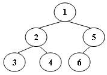

# 7-2 Tree Traversals Again

## Problem Description
Inorder traversal of a binary tree can be simulated non-recursively using a stack.

Given a sequence of stack operations during such a traversal:
- `Push X`: node `X` is visited and pushed onto the stack.
- `Pop`: pop the current stack top.

These operations correspond to exactly one valid binary tree.
Your task is to output the postorder traversal sequence of that tree.



## Input Specification
Each input contains one test case:
1. The first line is an integer `N` (`N <= 30`), the number of tree nodes (numbered from `1` to `N`).
2. The next `2N` lines are stack operations, each in one of the following formats:
	- `Push X`
	- `Pop`

## Output Specification
Print the postorder traversal sequence in one line.

Requirements:
- Numbers are separated by exactly one space.
- No extra space at the end of the line.
- A valid solution is guaranteed to exist.

## Sample Input
```text
6
Push 1
Push 2
Push 3
Pop
Pop
Push 4
Pop
Pop
Push 5
Push 6
Pop
Pop
```

## Sample Output
```text
3 4 2 6 5 1
```

## Note
The operation sequence uniquely determines one binary tree, so the postorder result is unique.